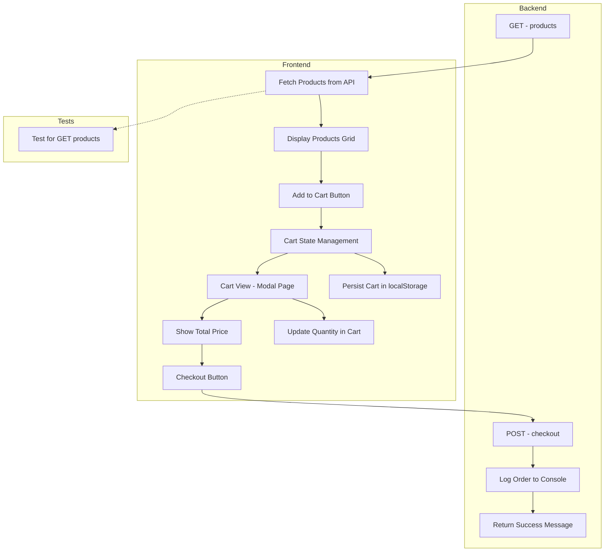

# Shopping Cart Application

A full-stack e-commerce shopping cart application built with React (Vite), Node.js, and Express.js.

## 🔄 Workflow




## 🚀 Features

- Product listing and display
- Shopping cart management
- Checkout process
- Responsive design with Tailwind CSS
- Server-side product management
- Order processing

## 🛠️ Tech Stack

### Frontend
- React.js with Vite
- Context API for state management
- Tailwind CSS for styling
- Responsive design

### Backend
- Node.js
- Express.js
- CORS enabled for frontend integration
- JSON data storage

## 📝 API Documentation

Base URL: `http://localhost:4000/api`

### Endpoints

#### 1. Get Products
- **URL**: `/products`
- **Method**: `GET`
- **Description**: Fetches the list of available products from `products.json`
- **Response**: Array of product objects

#### 2. Checkout
- **URL**: `/checkout`
- **Method**: `POST`
- **Description**: Processes the checkout order with customer details and cart items
- **Request Body**:
  ```json
  {
    "customer": {
      "name": "John Doe",
      "email": "john@example.com"
    },
    "items": [
      { "id": 1, "name": "Product A", "quantity": 2 },
      { "id": 2, "name": "Product B", "quantity": 1 }
    ],
    "total": 59.99
  }
  ```

## 🚀 Getting Started

### Prerequisites
- Node.js (v14 or higher)
- npm or yarn

### Installation

1. Clone the repository
```bash
git clone https://github.com/ronitghode/Shoping-cart-ronit.git
cd Shoping-cart-ronit
```

2. Install Frontend Dependencies
```bash
cd client
npm install
```

3. Install Backend Dependencies
```bash
cd ../server
npm install
```

### Running the Application

1. Start the Backend Server
```bash
cd server
npm start
```
The server will start on http://localhost:4000

2. Start the Frontend Development Server
```bash
cd client
npm run dev
```
The frontend will be available on http://localhost:5173

## 📦 Project Structure

```
Shoping-cart-ronit/
├── client/                 # Frontend React application
│   ├── src/
│   │   ├── components/    # React components
│   │   ├── store/        # Context API store
│   │   ├── App.jsx       # Main application component
│   │   └── main.jsx      # Entry point
│   └── index.html        # HTML template
└── server/               # Backend Node.js application
    ├── products.json    # Product data
    ├── server.js       # Express server
    └── server.test.js  # Server tests
```

## 📚 Additional Resources

For more detailed API documentation, visit:
[Postman Documentation](https://documenter.getpostman.com/view/36745142/2sB3QFQrkx)
